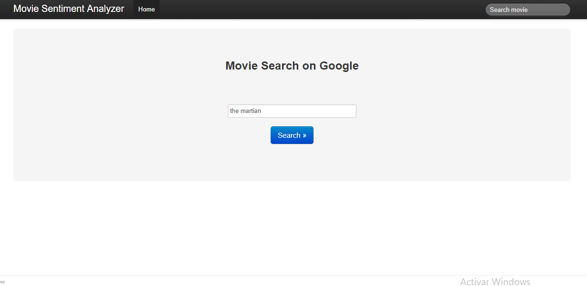
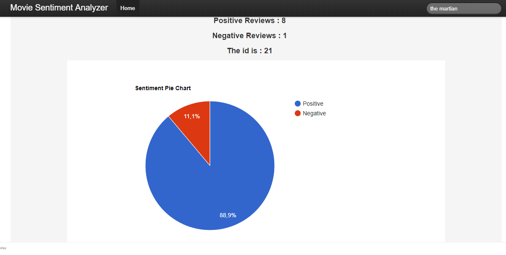
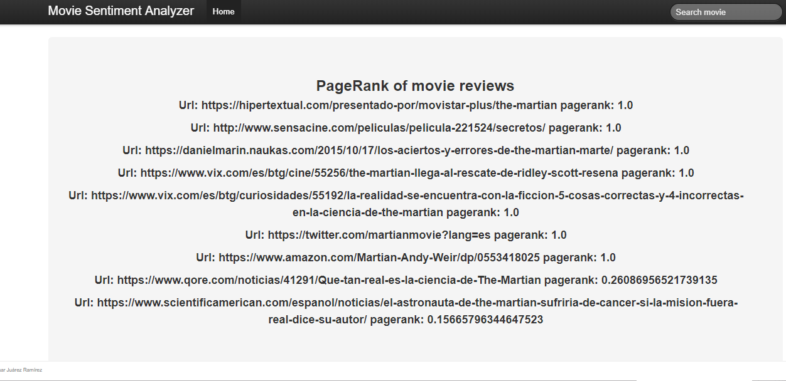
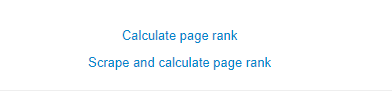

# Movie-Analyzer

Web application that analyses movie reviews scraped from the web given a user query and classifies them as positive or negative. 
Additionally a basic version of the PageRank algorithm was implemented to rank the web pages that contain the reviews. 

## Google/Bing scraping

A script using python's Request module and the lxml package is used to 
scrap the urls resulting from a Google/Bing search given a user query (movie title).

## HTML scraping

A second scraper is used to parse the html content from the urls obtained previously.
The scrapy and the newspaper packages are used to parse the html pages, select and finally get the
the movie reviews in text format. 

The scraping process takes some time. Once the reviews are extracted from the html pages, 
an id is generated for each web page and it is saved in the database along with its corresponding review is saved
for future queries so the next time the same query is performed the reviews are taken directly from
the database.

### Sentiment analysis
The sentiment analizer classifies the movie reviews as negative or positive using a Multinomial Naive Bayes model.
A pie chart is displayed with the classification results.

### Web spider and Page Rank
When the sentiment analysis results are displayed, the interface also allows the user to see the ranking 
of the pages where the reviews were taken from by clicking "Calculate Rank".
A crawler goes through each page and travels recursively through their links with a max depth of 2. Then a graph is 
created with all the gathered links and a Page Rank implementation with the power iteration method is implemented to 
perform the ranking.

It should be noted that the crawling process takes considerable time due to the parsing of the html pages. However, once
the pages where visited once, their links and their in and out relations are saved in the database so the
next time the same query is performed the crawling process just returns the links associated to the query so the Page Rank module
gets faster. From the interface perspective the button "Calculate page rank" does the calculation using information from the database and "Scrape and calculate page rank" 
does the scraping and calculation from stratch.

####-Framework details.

This engine is written in Python, Scikit-Learn and NLTK on top of NumPy and SciPy stack. It uses Django for webserver backend.

